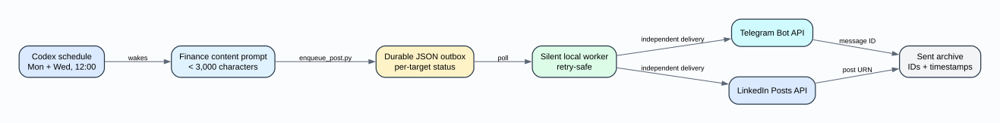
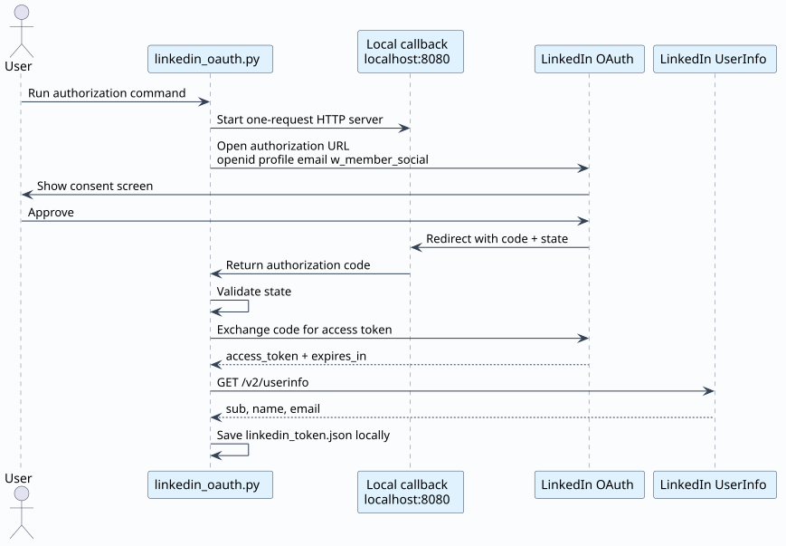
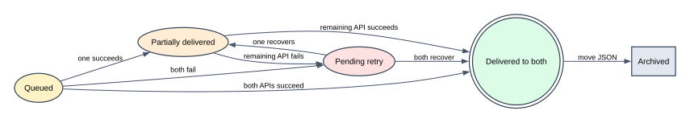

# LinkedIn + Telegram Content Agent

[](https://github.com/himanshusharma75035-sudo/linkedin-telegram-content-agent/actions/workflows/ci.yml)
[](https://www.python.org/)
[](LICENSE)
[](https://learn.microsoft.com/en-us/linkedin/marketing/community-management/shares/posts-api)
[](https://core.telegram.org/bots/api)

A small, dependency-free delivery agent that takes one generated post and
publishes it to both Telegram and a personal LinkedIn profile.

It was built for a practical workflow: Codex generates focused LinkedIn posts
on a schedule, writes them into a durable local queue, and a silent
background worker handles delivery independently for each platform.



## Why this project exists

Scheduled AI jobs and external APIs fail in different ways. A post can be
generated successfully while Telegram is temporarily unavailable, LinkedIn's
token is expired, or the laptop is offline.

This project separates generation from delivery:

```text
TUESDAY / THURSDAY, 12:00 PM
             |
             v
   Codex generates AI-news post
             |
             v
      Durable JSON outbox
        /             \
       v               v
 Telegram delivery   LinkedIn delivery
       |               |
       +-------> sent archive

MONDAY / WEDNESDAY, 3:00 PM
             |
             v
   Codex generates finance post
             |
             v
      Durable JSON outbox
        /             \
       v               v
 Telegram delivery   LinkedIn delivery
       |               |
       +-------> sent archive
```

Each target has its own delivery status. If Telegram succeeds and LinkedIn
fails, the worker retries only LinkedIn. That avoids duplicate posts.

## Features

- Publishes text posts to a personal LinkedIn profile through the official API
- Sends the same post to a Telegram bot chat
- Durable queue with per-platform retry state
- Duplicate-safe recovery schedules at 12:20 and 3:20
- Slot-aware delivery watchdogs at 12:35 and 3:35
- Telegram warning seven days before LinkedIn token expiry
- LinkedIn OAuth 2.0 authorization through a localhost callback
- Silent Windows startup using `pythonw.exe` and `wscript.exe`
- Standard-library Python; no runtime packages to install
- Secret-safe examples and git exclusions
- Copy-ready Codex prompts for AI news and finance/fintech content
- AI-first topic policy: approximately 70% practical AI-in-finance angles

## Repository map

```text
.
|-- src/
|   |-- common.py
|   |-- delivery_worker.py
|   |-- enqueue_post.py
|   |-- linkedin_oauth.py
|   |-- linkedin_post.py
|   `-- telegram_send.py
|-- scripts/
|   |-- install_startup.ps1
|   |-- run_worker.ps1
|   |-- start_worker_silent.vbs
|   `-- uninstall_startup.ps1
|-- prompts/
|   |-- finance-linkedin-post.md
|   |-- recovery-check.md
|   |-- finance-monday-wednesday-post.md
|   `-- finance-recovery-check.md
|-- docs/
|   `-- diagrams/
|-- tests/
|-- linkedin.env.example
`-- telegram.env.example
```

## Requirements

- Python 3.10 or newer
- A Telegram bot
- A LinkedIn Developer app with:
  - **Share on LinkedIn**
  - **Sign In with LinkedIn using OpenID Connect**
- A scheduler or AI agent that can run `src/enqueue_post.py`

## 1. Clone and check

```powershell
git clone https://github.com/himanshusharma75035-sudo/linkedin-telegram-content-agent.git
cd linkedin-telegram-content-agent
python -m unittest discover -s tests -v
```

## 2. Configure Telegram

### Create a bot

1. Open `@BotFather` in Telegram.
2. Send `/newbot`.
3. Follow the prompts and copy the bot token.
4. Open your new bot and send `/start`.

Copy the example:

```powershell
Copy-Item telegram.env.example telegram.env
```

Set the bot token first:

```env
TELEGRAM_BOT_TOKEN=123456789:replace_with_bot_token
TELEGRAM_CHAT_ID=replace_after_discovery
```

Discover your chat ID:

```powershell
python src/telegram_send.py --get-updates
```

Put the returned private chat ID into `telegram.env`, then test:

```powershell
python src/telegram_send.py "Telegram setup works."
```

## 3. Create the LinkedIn app

The LinkedIn Page associated with the developer app is not automatically the
posting destination. Personal-profile publishing uses your authenticated member
ID and the `w_member_social` permission.

Page publishing is optional and restricted. It requires an organization author
URN, LinkedIn approval for `w_organization_social`, and an eligible admin or
content role on the Page.

### Create the required LinkedIn Page

LinkedIn requires a developer app to be associated with a LinkedIn Page.

1. Open LinkedIn and choose **For Business > Create a Company Page**.
2. Select **Company**.
3. Create a simple Page for the project or your professional brand.
4. You must be an administrator of this Page.

### Create the developer app

1. Open the [LinkedIn Developer Portal](https://www.linkedin.com/developers/apps).
2. Select **Create app**.
3. Enter an app name.
4. Select the LinkedIn Page created above.
5. Upload a square logo and accept the API terms.
6. Create the app.

### Add API products

On the app's **Products** tab, request these products:

1. **Share on LinkedIn**
2. **Sign In with LinkedIn using OpenID Connect**

The first grants `w_member_social`, which permits posting on behalf of the
authenticated member. The second identifies the personal profile through
OpenID Connect.

### Add the redirect URL

On the app's **Auth** tab, add this exact authorized redirect URL:

```text
http://localhost:8080/linkedin/callback
```

Copy the credential example:

```powershell
Copy-Item linkedin.env.example linkedin.env
```

Open `linkedin.env` and add the values shown on the Auth tab:

```env
LINKEDIN_CLIENT_ID=replace_with_client_id
LINKEDIN_CLIENT_SECRET=replace_with_client_secret
LINKEDIN_REDIRECT_URI=http://localhost:8080/linkedin/callback
LINKEDIN_API_VERSION=202604
```

> [!CAUTION]
> The Client ID may be shown in screenshots, but the Client Secret and access
> token must never be committed, pasted into chat, or placed in an issue.

Authorize your personal profile:

```powershell
python src/linkedin_oauth.py
```

LinkedIn opens in the browser. Approve the requested permissions. The local
callback stores the token in `linkedin_token.json`, which is excluded by
`.gitignore`.



LinkedIn member tokens commonly expire and may require running the OAuth
command again. The worker records a clear error instead of discarding the post.
The API version is pinned rather than derived from the current date because a
new calendar month can begin before LinkedIn activates that month's API
version. Update `LINKEDIN_API_VERSION` only to a version listed as active in
LinkedIn's official versioned API documentation.

## 4. Queue and deliver a post

Queue text for both platforms:

```powershell
"A complete LinkedIn post..." | python src/enqueue_post.py
```

Process the queue once:

```powershell
python src/delivery_worker.py --once
```

Run continuously:

```powershell
python src/delivery_worker.py
```



## 5. Run silently on Windows

Install a per-user startup entry:

```powershell
powershell -ExecutionPolicy Bypass -File scripts/install_startup.ps1
```

Start it immediately without a visible console:

```powershell
wscript.exe scripts/start_worker_silent.vbs
```

Remove startup later:

```powershell
powershell -ExecutionPolicy Bypass -File scripts/uninstall_startup.ps1
```

The worker prefers `pythonw.exe`, preventing a console window from remaining
on screen during the workday.

## 6. Connect Codex

Use the prompts in this repository for two independent Codex content tracks:

- [`prompts/finance-linkedin-post.md`](prompts/finance-linkedin-post.md):
  Tuesday/Thursday 12:00 PM short global AI-news post
- [`prompts/recovery-check.md`](prompts/recovery-check.md): Tuesday/Thursday 12:20 PM
  AI-news recovery check
- [`prompts/finance-monday-wednesday-post.md`](prompts/finance-monday-wednesday-post.md):
  Monday/Wednesday 3:00 PM finance post
- [`prompts/finance-recovery-check.md`](prompts/finance-recovery-check.md):
  Monday/Wednesday 3:20 PM finance recovery check

Each primary automation's final action is:

```powershell
python src/enqueue_post.py
```

Pass the generated post through standard input. The automation should not call
Telegram or LinkedIn directly; the local worker owns delivery and retries.

Recovery automations should first check the relevant sent/outbox artifacts and
generate a post only when the primary run produced nothing. The local watchdog
checks the Tuesday/Thursday AI-news slot after 12:35 PM and the Monday/Wednesday finance slot
after 3:35 PM, sending one Telegram alert per missed slot.

## Security model

- Real `.env` and token files are ignored.
- The queue tracks Telegram and LinkedIn separately.
- API responses are not written into public logs.
- OAuth state protects the localhost callback against CSRF.
- The worker publishes only queue files created locally.

See [SECURITY.md](SECURITY.md) before deploying this on a shared machine.
Maintainers should also follow the
[live-automation synchronization contract](docs/MAINTENANCE.md).

## Diagram sources

This repository intentionally avoids Mermaid. Its documentation uses:

- Graphviz DOT for the architecture map
- PlantUML for the OAuth sequence
- Graphviz state-machine notation for delivery states
- Plain ASCII for the operational flow

Editable sources live in [`docs/diagrams`](docs/diagrams).

## License

[MIT](LICENSE)
